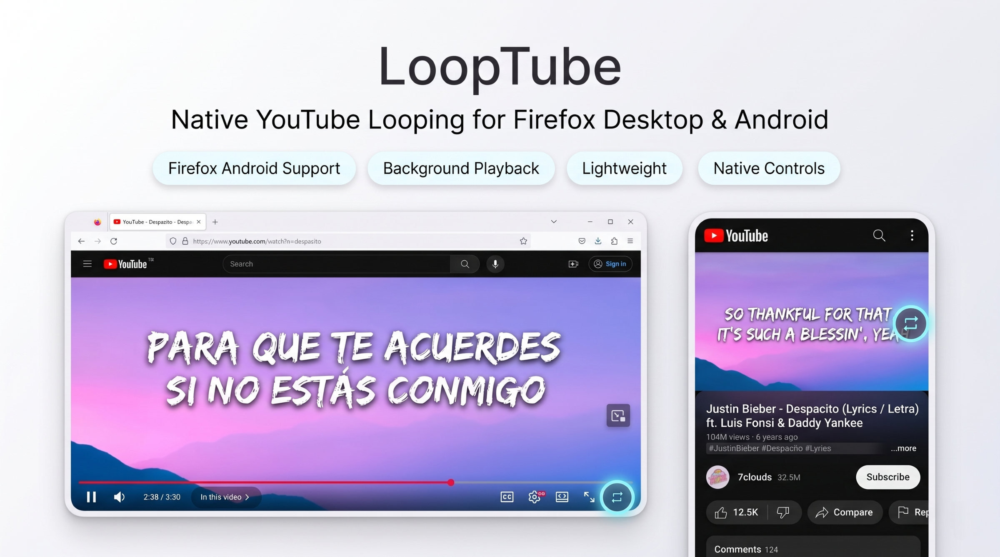
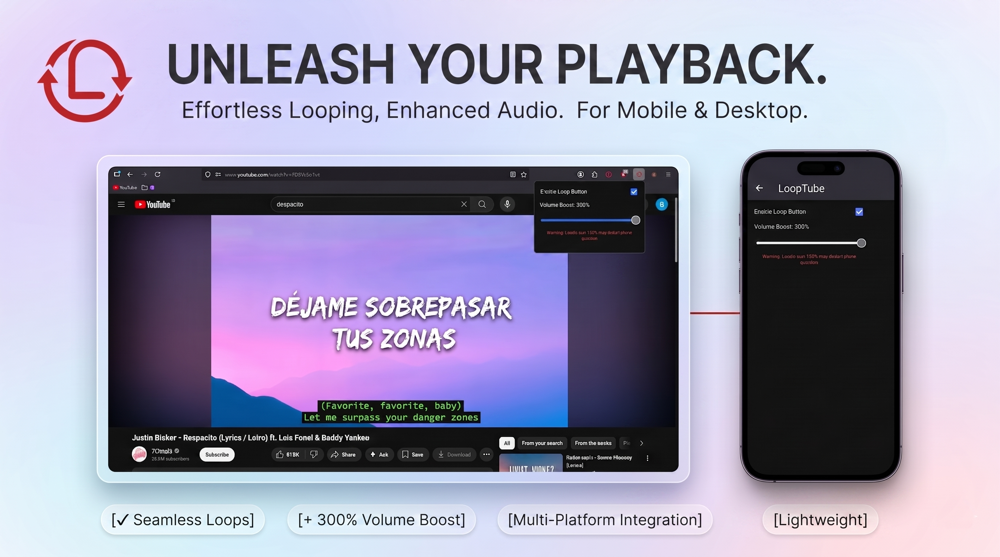

# LoopTube

[](YOUR-ADDON-LINK)


A lightweight Firefox extension that adds a native-feeling loop button directly inside the YouTube video player, plus a studio-grade volume booster for quiet videos.

---

<p align="center">
  
  
</p>

---

## Overview

LoopTube gives you total control over YouTube's playback natively. It integrates a loop control directly into the player interface and features a custom audio pipeline to safely push video volume past hardware limits without blowing out your speakers.

Built to stay lightweight, responsive, and visually consistent with YouTube’s UI across both desktop and mobile layouts.

---

## What's New in v1.2.1

* Added a 350% VLC-style volume boost 
* Integrated a Web Audio API dynamic limiter to prevent speaker clipping
* Added a popup UI toggle to control the audio pipeline
* Improved background playback stability for mobile users

---

## Features

* Native-style loop button integrated into YouTube controls
* Toggle loop instantly with one click
* Safe 350% volume boost using dynamic brickwall compression
* Keyboard shortcut (**L**) on desktop
* Full mobile YouTube support
* Background playback support on mobile Firefox
* Remembers loop and audio states per video
* Works with autoplay and dynamic navigation
* Reliable handling of YouTube UI re-renders
* Controls appear and disappear naturally with YouTube overlays
* Lightweight with no external dependencies

---

## Installation

### Firefox Add-ons

[Download LoopTube directly from the Firefox Add-ons store](https://addons.mozilla.org/en-US/firefox/addon/looptube/) for automatic updates and secure installation.


## Privacy

LoopTube does not collect, store, or transmit any user data.

All functionality runs locally within the browser.

---

## Permissions

* `storage` — used only to save loop and volume preferences locally

---

## Compatibility

* Firefox Desktop
* Firefox for Android
* YouTube Desktop (`www.youtube.com`)
* YouTube Mobile Web Interface

---

## Project Structure

```text
looptube/
├── manifest.json
├── content.js
├── popup.html
├── popup.js
├── style.css
├── icons/
└── assets/
